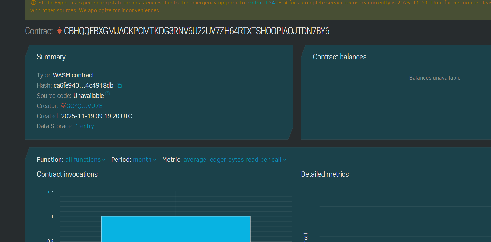

# ChainDebt Manager

## Project Title
ChainDebt Manager

## Project Description
ChainDebt Manager is a decentralized peer-to-peer debt recording and settlement system built on Soroban smart contracts on the Stellar blockchain. It allows individual lenders and borrowers to transparently record debts, track repayments, compute interest, and confirm settlements without intermediaries, enhancing trust and reducing disputes.

## Project Vision
The vision of ChainDebt Manager is to create a transparent, immutable, and autonomous debt management ecosystem that replaces traditional paper contracts and manual reconciliations with blockchain-enforced agreements. This aims to empower users with trustable, tamper-proof debt records and flexible repayment tracking, fostering financial inclusion and accountability.

## Key Features
- **Debt Record Creation:** Lenders can create debt records specifying borrower, amount, interest, duration, and terms.
- **Autonomous Repayments:** Borrowers and lenders record repayments on-chain at any time, with amounts accumulating.
- **Interest Calculation:** Simple interest is automatically calculated based on principal, rate, and duration.
- **Status Tracking:** The system flags when debts are fully paid (settled).
- **Secure Access:** Only involved parties can update or repay debts.
- **Immutable Ledger:** Debt records and repayments are securely stored and auditable on the blockchain.
- **Debt Query:** Any party can query detailed debt status and repayment history.

## Usage Instructions
1. **Set Admin (Optional):** One-time setup to establish contract administrator if needed.
2. **Create Debt:** Lender creates new debt assigning borrower, principal, interest, duration, and description.
3. **Record Repayments:** Borrower or lender records debt repayments over time.
4. **Query Debt:** Users retrieve the current status, remaining balance, and repayment details.
5. **Check Settlement:** Confirm if debt is fully settled based on repayments and interest.

## Future Scope
- **Flexible Interest Models:** Add compound interest, penalties for late payments, or tiered rates.
- **Partial Debt Transfers:** Allow trading or sharing debts among multiple parties.
- **Dispute Resolution:** Integrate decentralized arbitration for debt disputes.
- **Automated Reminders:** Notifications for upcoming or late repayments.
- **User Profiles:** Link credit scores or histories to borrower addresses.
- **Multi-Currency Support:** Accept repayments in different currencies or tokens.
- **Front-end Applications:** Build interfaces for easy debt management and visualization.

## Technology Stack
- Soroban SDK with Rust for smart contract logic
- Stellar blockchain for decentralized trust and immutable recording
- Blockchain-native computation of debt interest and status

## Contribution
Contributions from developers and financial domain professionals are welcome to enrich functionality, UI, and compliance features. Fork and submit pull requests.

## License
Licensed under the MIT License.

### Contract Details
ID : CBHQQEBXGMJACKPCMTKDG3RNV6U22UV7ZH64RTXTSHOOPIAOJTDN7BY6

